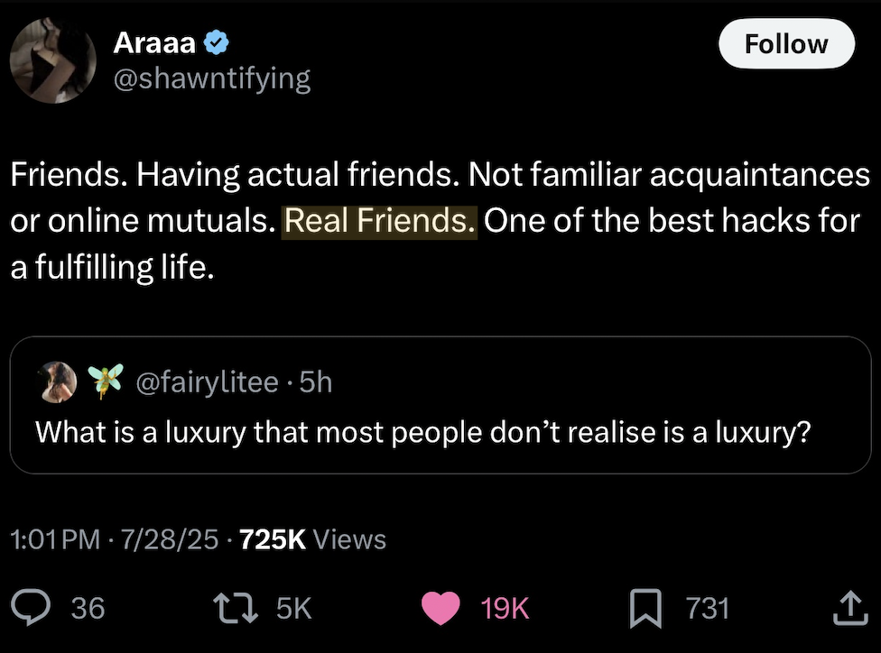

# WhyDidHeEditHisOwnWikiArticle_WhatNewGriftIsHeCookingUpForAttention_WhatsGoingOn

https://en.wikipedia.org/w/index.php?title=Jason_H._Moore&action=history

OMG its so sad that no one would update his wikipedia article so he had to do it himself

i need to powerwash my brain thinking about how pathetic that is

its funny too what a miserable and UGLY-ASS human being that just wont go away

my theory is that when he feels like a big fking loser, he edits his own wiki page to get some power back

something happened where he realized, he's a big fking loser

# this man has no friends (that would edit his wikipedia page), does not live a fulfilling life

# he's just a big loser

# nobody cares about him, nobody wants to send him voice notes, nobody wants to send him songs, nobody wants to send him pictures, he's absolutely a total fking loser in life

# that's what he's been hiding all these years, that nobody likes him bc hes disgusting

ignore him, dont let anything that happened, anything he said or did get to u, he will be annihilated in court, it will absolutely happen that way

